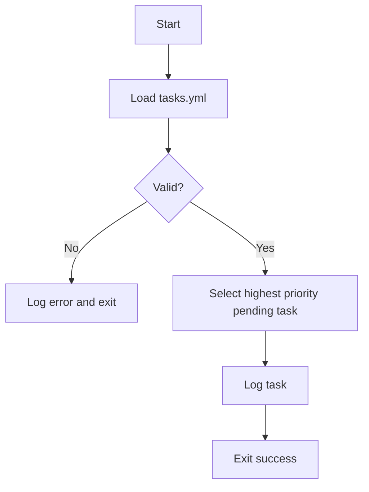
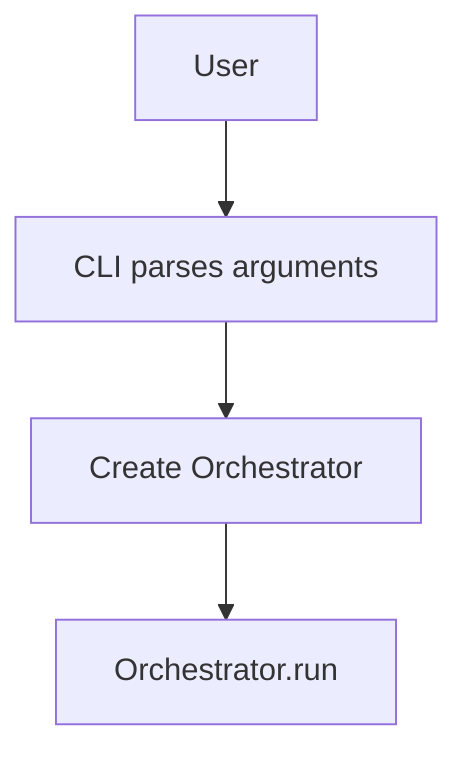
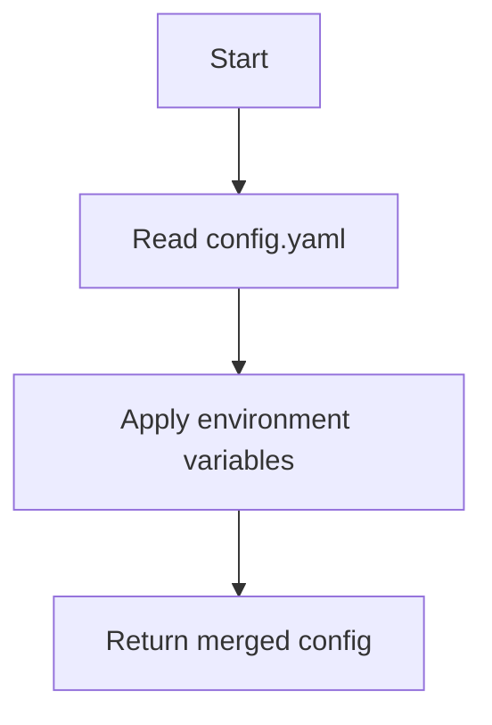

# System Architecture

## Components

### Orchestrator
Coordinates the main control loop for the self-improving system. It initializes with components like `Planner`, `Executor`, `Reflector`, and `Memory`. The `run` method orchestrates the primary workflow: loading tasks from persistence (e.g., `tasks.yml`) using `Memory`, invoking the `Reflector` to analyze the codebase and potentially generate new tasks (which are then saved back via `Memory`), and then entering a loop. In this loop, it uses the `Planner` to decide the next task, marks the task as "in_progress" (saving state), executes it using the `Executor`, and finally marks it as "done" (again, saving state). The loop continues until the `Planner` determines no more actionable tasks are available.
State management is delegated to helper methods (`_set_status`, `_save_tasks` and `_audit_and_extend`) which handle persistence and auditing. This keeps `_execute_task` concise.

```python
class Orchestrator:
    """
    Coordinates the self-improving loop of task planning, execution, and reflection.
    """
    def __init__(self, planner, executor, reflector, memory):
        """
        Initializes the Orchestrator with necessary components.

        Args:
            planner: An instance of the Planner class.
            executor: An instance of the Executor class.
            reflector: An instance of the Reflector class.
            memory: An instance of the Memory class for loading/saving tasks.
        """
        self.planner = planner
        self.executor = executor
        self.reflector = reflector
        self.memory = memory

    def run(self, tasks_file: str = 'tasks.yml'):
        """
        Runs the main orchestration loop.

        The loop consists of:
        1. Loading tasks.
        2. Running a reflection cycle to potentially add/modify tasks.
        3. Iteratively planning, executing, and updating task statuses.

        Args:
            tasks_file (str): The name of the file from which to load and
                              to which to save tasks. Defaults to 'tasks.yml'.
        """
        # tasks = self.memory.load_tasks(tasks_file)
        # ... Full method implementation as in core/orchestrator.py
        pass # Placeholder for brevity in markdown
```

### CLI
Provides a thin command line wrapper around the `Orchestrator`. The
entrypoint defined in `core.cli` parses arguments, creates a `Memory`
instance and then runs the orchestrator.

```python
from pathlib import Path
from core.orchestrator import Orchestrator
from core.memory import Memory

def main(argv=None):
    parser = build_parser()
    args = parser.parse_args(argv)
    memory = Memory(Path(args.memory))
    orchestrator = Orchestrator(None, None, None, memory, None)
    orchestrator.run()
```

### Orchestrator API
`services.orchestrator_api` exposes REST endpoints to start, stop and
check the status of the orchestrator. It simply spawns the CLI
subprocess using `uvicorn` as a container entrypoint.

```
POST /start   -> launch orchestrator process
POST /stop    -> terminate the process
GET  /status  -> return running PID or false
```

### Memory
Simple persistence helper for storing JSON state on disk. The API exposes
`load()`/`save()` for generic JSON data and `load_tasks()`/`save_tasks()`
for YAML task lists. All methods create parent directories as needed.

```python
from pathlib import Path
import json

class Memory:
    def __init__(self, path: Path):
        self.path = Path(path)

    def load(self):
        """Return stored data or an empty dict if no file exists."""
        pass

    def save(self, data):
        """Write data to disk creating directories as needed."""
        pass

    def load_tasks(self, tasks_file: str):
        """Return tasks from ``tasks_file`` or an empty list."""
        pass

    def save_tasks(self, tasks, tasks_file: str):
        """Write ``tasks`` back to ``tasks_file``."""
        pass
```

### Planner
The `Planner` decides which task should run next while tracking an optional
execution budget. The heavy lifting is delegated to helper functions in
`core.planner_utils` which keeps the class small and testable. Tasks are
considered **pending** when their status is ``"pending"`` and all declared
dependencies are marked ``"done"``.

```python
class Planner:
    """Plan task execution order while tracking a cost budget."""

    def plan(self, tasks: list) -> object | None:
        """Return the next runnable task or ``None``."""

        if is_budget_exhausted(self.budget, self.cost_used):
            return None

        validate_unique_ids(tasks)
        ready = filter_ready_tasks(get_pending_tasks(tasks), tasks)
        if not ready:
            return None

        task = select_highest_priority(ready)
        cost = getattr(task, "cost", 1)
        if will_exceed_budget(self.budget, self.cost_used, cost):
            return None
        self.cost_used, self._warned = increment_cost_and_warn(
            self.cost_used, self.budget, self.warning_threshold, self._warned, cost
        )
        return task
```

### Executor
The `Executor` is responsible for carrying out a given task. It prints a short
message describing the task and, when a `command` attribute is present, executes
that command. The command's output is captured and written to a timestamped file
inside the `logs/` directory.

```python
class Executor:
    """Carry out a task and persist any command output."""

    def execute(self, task: object) -> None:
        """Print a summary and optionally run ``task.command``.

        If ``task`` defines a ``command`` attribute it is executed using
        ``subprocess.run`` with output captured. The text from stdout and stderr
        is written to ``logs/task-<id>-<timestamp>.log``.
        """

        # ... Full method implementation as in ``core/executor.py``
```

### SelfAuditor
Evaluates code metrics and decides when refactors are required. Metrics are
obtained via **radon** (cyclomatic complexity and maintainability index) and,
optionally, **wily** for historical trends. The auditor never changes source
files itself. Instead it returns task dictionaries that the `Planner` appends to
`tasks.yml`. Each task describes the module, offending score and a brief
refactor suggestion.

```python
class SelfAuditor:
    def __init__(
        self,
        complexity_threshold: int = 15,
        maintainability_threshold: str = "B",
        use_wily: bool = False,
    ):
        self.complexity_threshold = complexity_threshold
        self.maintainability_threshold = maintainability_threshold
        self.use_wily = use_wily

    def analyze(self, paths):
        """Return a mapping of file paths to radon metrics."""

    def audit(self, tasks):
        """Return new task entries when metrics exceed configured thresholds."""
```

When ``use_wily`` is enabled the auditor runs ``wily build`` to update the
history cache and reads metrics from the previous revision. The difference in
complexity influences task priority—files getting worse are prioritised while
improvements lower the urgency.

After each execution cycle the `Orchestrator` calls `SelfAuditor.audit()` with
the current task list. Any returned entries are appended through the `Planner`,
which rewrites `tasks.yml` so that future iterations can schedule the
recommended refactors.

### Reflector
Coordinates a self-improvement cycle by scanning the repository and appending
new tasks when code complexity exceeds a threshold.

```python
from pathlib import Path
import yaml
from radon.complexity import cc_visit


class Reflector:
    def __init__(self, tasks_path: Path, threshold: int = 10, paths=None):
        self.tasks_path = Path(tasks_path)
        self.threshold = threshold
        self.paths = [Path(p) for p in paths] if paths else None

    def run_cycle(self):
        files = self.paths or list(Path('.').rglob('*.py'))
        metrics = self._analyze(files)
        tasks = self._load_tasks()
        new = self._decide(metrics, tasks)
        if new:
            tasks.extend(new)
            self._save_tasks(tasks)
        return new
```

## Main Orchestration Loop
This diagram illustrates the primary control flow managed by the `Orchestrator`'s `run` method.

```mermaid
flowchart TD
    subgraph Orchestrator Run Cycle
        direction LR
        StartRun[Start run()] --> LoadTasks(Load tasks from Memory)
        LoadTasks --> RunReflector(Call Reflector.run_cycle())
        RunReflector --> SaveReflectedTasks(Save updated tasks to Memory)
        SaveReflectedTasks --> LoopDecision{Actionable task?}

        subgraph Task Execution Loop
            direction LR
            LoopDecision -- Yes --> PlanNext(Planner.plan())
            PlanNext --> TaskSelected{Task available?}
            TaskSelected -- Yes --> MarkInProgress(Update task: in_progress)
            MarkInProgress --> SaveInProgress(Save tasks to Memory)
            SaveInProgress --> ExecuteTask(Executor.execute())
            ExecuteTask --> MarkDone(Update task: done)
            MarkDone --> SaveDone(Save tasks to Memory)
            SaveDone --> LoopDecision
        end

        TaskSelected -- No --> EndLoop(End Loop)
        LoopDecision -- No --> EndLoop
        EndLoop --> FinishRun[Finish run()]
    end
```

## Bootstrapping Flow


## CLI Invocation Flow


## Configuration Flow


Configuration is loaded with `config.load_config()` which merges
`config.yaml` with any environment overrides. See the
[README Configuration](README.md#configuration) section for the list of
available variables.

### Diff Utility
Utility functions ``generate_diff`` and ``generate_file_diff`` in
``core.diff_utils`` emit unified diffs when file contents change.

### Broker
The broker is a lightweight FastAPI application that stores tasks in a
SQLite database. It exposes REST endpoints to create and list tasks and
retrieve an individual task by ID. The database path defaults to
``tasks.db`` but can be overridden via the ``DB_PATH`` environment
variable.

To run the broker inside a container build the image and publish port
``8000``:

```bash
docker build -f broker/Dockerfile -t broker .
docker run -p 8000:8000 broker
```

The container launches ``uvicorn broker.main:app``.

```python
from fastapi import FastAPI
import sqlite3

app = FastAPI()

@app.post("/tasks")
def create_task(task: Task):
    ...
```

### Worker
Workers run inside Docker containers and poll the broker for tasks.
Each worker requests the next pending task from the broker's queue using
``GET /tasks/next``. The returned task provides a shell ``command`` which is
executed in an isolated sandbox. Results are reported back with
``POST /tasks/{id}/result``. A minimal Dockerfile installs the project
requirements and launches ``worker/main.py``.

### Node.js IOService
Certain I/O-heavy functionality is offloaded to a lightweight Node.js
microservice. Communication with the Python core occurs over gRPC to
ensure a language-agnostic contract. The ``IOService`` exposes a simple
``Ping`` RPC defined in ``proto/io_service.proto``. The Node server lives
under ``services/node`` and is started independently. A small Python
client in ``core.io_client`` allows the orchestrator or other modules to
invoke this service when needed. The Node process also runs a small Express
server on the metrics port (default ``9100``) exposing ``/metrics`` for
Prometheus scraping and ``/health`` which returns JSON including service
``uptime`` and ``status`` for basic health checks.

### Vision Engine
Ranks epics using Weighted Shortest Job First (WSJF) scores. An optional
``RLAgent`` can refine this ordering. The agent begins in **shadow mode**
where its suggestions are logged but not applied. Logged suggestions are
stored in JSON lines so that offline training can analyse how the agent
would have re-ranked tasks.

The ``RLAgent`` tracks an ``authority`` value from ``0.0`` to ``1.0``. The
``VisionEngine`` applies the agent's ordering to the top fraction of tasks
equal to this authority. The value only increases when observed

### Intent Mapper
Receives prioritized epics from the Vision Engine and breaks them into
executable tasks. Each epic is decomposed into a sequence of tasks with
explicit dependencies and a default priority. The mapper records the
originating epic so downstream components can trace the lineage of each
task. This keeps the backlog synchronized with higher-level goals.

### Production Simulation Environment
The Reflector Core uses a **ProductionSimulator** to mirror the behavior of the
live system. The simulator models key services, databases, and load balancers
so that agents can interact with realistic state transitions. Workload traces
are loaded from JSON files to replay real traffic patterns. The simulator
publishes metrics through the existing ``MetricsProvider`` interface and
supports the same action space exposed in production. This allows reinforcement
learning agents to train safely while observing near-production metrics.

## Dependencies
- **PyYAML==6.0.1** - Safe YAML parsing
- **pytest==7.4.0** - Test execution
- **jsonschema==4.21.0** - Validate task schema
- **radon==5.1.0** - Compute code complexity metrics
- **wily==1.25.0** - Track complexity over Git history
- **pylint==3.3.7** - Linting and style checks

## Persistence Strategy
State such as tasks and logs are stored on disk. Tasks are kept in `tasks.yml` and
logs are written to the `logs/` directory. Future components may store structured
state in JSON files or use lightweight databases like SQLite.

## Plugins
Plugins extend the core system with optional capabilities. Each plugin lives in
its own directory under `plugins/` and contains a `manifest.json` describing the
plugin and its required permissions. Manifests are loaded with
`core.plugins.load_manifest` which validates them against
`plugins/manifest_schema.json` and checks permissions via
`core.security.validate_plugin_permissions`. When the environment variable
`PLUGIN_SIGNING_KEY` is configured, signatures declared in the manifest are
verified with `core.security.verify_plugin_signature` to prevent tampering.

The helper `discover_plugins` walks the plugin directory to load all manifests.
At runtime the orchestrator can import a plugin module and call its `run()`
function. Future revisions will execute plugins inside a sandbox container as
described in tasks **135** and **143–146**. These tasks outline the automated
certification pipeline—static analysis, dependency scans, sandboxed tests and
cryptographic signing—that must be completed before a plugin is allowed to run.
