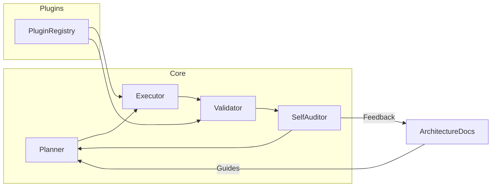

# SelfArchitectAI • The Self-Evolving Software Architect Agent

> "Big ideas deserve big code—let AI design, build, test, and improve itself at scale."

SelfArchitectAI is more than a code generator. It acts as a meta‑architect that reasons about its own design, pulls in proven libraries, spawns modular components, and continually refines its architecture.

Our mission is to build an open platform where autonomous agents and human contributors collaborate to evolve high‑quality software responsibly.

See [CONTRIBUTING.md](CONTRIBUTING.md) for how to get involved and [GOVERNANCE.md](GOVERNANCE.md) for the decision-making process.

---

## 🔭 Vision

- **Infinite Evolution** – The agent can bootstrap itself and then iterate, adding new plugins or re‑architecting modules on the fly.
- **Ecosystem‑First** – Leverage the rich Python ecosystem instead of reinventing the wheel.
- **Self‑Aware Architecture** – Architecture is a living artifact: document it, visualize it, and let the agent reason about technical debt and test coverage.

---

## 🚀 Core Capabilities

1. **Dynamic Dependency Management** – Install and pin libraries for reproducibility while allowing safe upgrades.
2. **Modular Component Pipeline** – Planner, Executor, Validator, and SelfAuditor work in a loop to build and refine the project.
3. **Plugin Ecosystem** – Drop in new capabilities as discrete plugins that integrate with the core blueprint.
4. **Continuous Self‑Improvement** – Evaluate test coverage, performance, and code quality to propose refactors.

---

## 🏗️ Architecture Overview



Planner decides what to build next. The Executor writes files and configures CI/CD. The Validator runs tests and benchmarks. The SelfAuditor updates `ARCHITECTURE.md` with metrics and diagrams.

---

## 🛠️ Getting Started

1. **Clone & Install**
   ```bash
   git clone https://github.com/your-org/ai-swa.git
   cd ai-swa
   pip install -r requirements.lock
   # When upgrading dependencies
   pip-compile requirements.txt --output-file requirements.lock
   ```
2. **Install Pre-commit Hooks**
   ```bash
   pip install pre-commit
   pre-commit install
   ```
3. **Run the Initial Bootstrap**
   ```bash
   python3 run_bootstrap.py
   ```
4. **Start the Orchestrator**
   ```bash
   python -m ai_swa.orchestrator --config config.yaml start
   # List tasks
   python -m ai_swa.orchestrator list
   # Check status
   python -m ai_swa.orchestrator status
   # Later stop it
   python -m ai_swa.orchestrator stop
   ```
   The `orchestrator-api` service exposes equivalent REST endpoints
   (`/start`, `/stop`, `/status`) when running under Docker Compose.
5. **Explore the Blueprint** – Open `ARCHITECTURE.md` to see components and dependency rationales.
6. **Read Cross-Language Guidelines** – See [cross_language_guidelines.md](docs/architecture/cross_language_guidelines.md) for how Python, Rust and Node services interact.
7. **Watch It Evolve** – Each execution may introduce new tasks or propose refactors. Review and merge the generated commit.
8. **Run with Docker Compose**
   ```bash
   docker-compose up --build
   ```
   This starts the orchestrator, broker, worker, API gateway and Node service
   containers. Each service uses its own volume to demonstrate the
   database-per-service pattern. All traffic is routed through the gateway on
   port `8080`. The Node service exposes its gRPC API on port `50051` and
   provides `GET /health` on the metrics port (default `9100`) for container
   health checks.
   If you want to enable the optional Rust optimizations, run `maturin develop`
   inside the `rust_ext` directory before starting the compose stack.
   
   **Note:** Docker must be available for this step. In restricted environments
   where the Docker daemon cannot start (such as some online sandboxes), the
   compose stack will fail to run. You can still execute unit tests by
   installing dependencies directly or by using the [VS Code Dev
   Container](docs/deployment/devcontainer.md), but the full workflow with all
   services will be skipped.
9. **Run End-to-End Tests**
   ```bash
   pytest tests/e2e/ --maxfail=1 --disable-warnings -q
   ```
   These tests spin up the orchestrator, broker and worker with `docker-compose`,
   execute a demo task, and assert metrics/logs to ensure the pipeline works.

### CLI Usage

```
python -m ai_swa.orchestrator --config config.yaml start
python -m ai_swa.orchestrator list
python -m ai_swa.orchestrator status
python -m ai_swa.orchestrator stop
```

The `ai-swa` command provides a thin wrapper around the HTTP API:

```
ai-swa start
ai-swa status
ai-swa stop
```

## Configuration

SelfArchitectAI loads settings from `config.yaml` by default. Set the `CONFIG_FILE`
environment variable to specify an alternative location. Environment variables always
override values from the file so you can adjust settings per environment.

Use `config.load_config()` inside any service to access the merged
configuration dictionary. The returned object contains sections like
`broker`, `worker`, `node`, `security`, `sandbox`, `planner`, and `logging`.

### Required environment variables

- `DB_PATH` – path to the broker SQLite database
- `BROKER_URL` – broker service URL used by the worker and orchestrator

### Optional environment variables

| Variable | Description | Default |
| --- | --- | --- |
| `BROKER_METRICS_PORT` | Port exposing broker Prometheus metrics | `9000` |
| `WORKER_METRICS_PORT` | Port exposing worker Prometheus metrics | `9001` |
| `METRICS_PORT` | Set both broker and worker metrics ports at once | *(unset)* |
| `WORKER_CONCURRENCY` | Number of tasks the worker runs in parallel | `2` |
| `NODE_HOST` | Hostname of the Node I/O service | `localhost` |
| `NODE_PORT` | gRPC port of the Node I/O service | `50051` |
| `API_KEY` | Shared API key required for API access | *(unset)* |
| `API_TOKENS` | Comma separated tokens mapping to `username:role` | *(unset)* |
| `PLUGIN_SIGNING_KEY` | HMAC key used to verify plugin manifests | *(unset)* |
| `PLUGIN_POLICY_FILE` | Path to plugin policy JSON | `plugins/policy.json` |
| `TOOL_REGISTRY_FILE` | Approved CLI tools registry | `plugins/tool_registry.json` |
| `SANDBOX_ROOT` | Directory used for isolated plugin execution | `sandbox` |
| `PLANNER_BUDGET` | Maximum planner steps before warning | `0` |
| `LOG_CONFIG` | Path to logging configuration file | `logging.conf` |
| `LOG_LEVEL` | Root logging level | `INFO` |
| `LOG_FILE` | Optional log file path | *(unset)* |
| `CONFIG_FILE` | Alternate config YAML location | `config.yaml` |
| `ORCH_URL` | Orchestrator API URL used by API gateway | `http://orchestrator-api:8002` |
| `OTEL_EXPORTER_OTLP_ENDPOINT` | OTLP metrics export endpoint | *(unset)* |
| `OTEL_EXPORTER_OTLP_CERTIFICATE` | TLS certificate for OTLP endpoint | *(unset)* |

### Sample `config.yaml`

```yaml
broker:
  db_path: tasks.db
  metrics_port: 9000
worker:
  broker_url: http://broker:8000
  metrics_port: 9001
  concurrency: 2
node:
  host: localhost
  port: 50051
security:
  api_key: null
  api_tokens: null
  plugin_signing_key: null
```

### Sample `.env`

```env
DB_PATH=tasks.db
BROKER_URL=http://localhost:8000
WORKER_CONCURRENCY=4
API_KEY=changeme
API_TOKENS=alice:admin,bob:viewer
```

The worker will execute up to `WORKER_CONCURRENCY` tasks simultaneously. This
value defaults to `2` in `config.yaml` and can be overridden by the
`WORKER_CONCURRENCY` environment variable.

## Security Model

The broker API requires authentication on every request. Configure a shared
`API_KEY` and a set of bearer tokens with associated roles through the
`API_TOKENS` variable. Tokens are provided as comma separated
`token:username:role` triples. Each HTTP request must include `Authorization:
Bearer <token>` and (when configured) the `X-API-Key` header.

Two roles are currently recognised:

- `admin` – full access to create tasks and submit results.
- `worker` – may fetch tasks and record execution results.

If no tokens are configured the broker allows anonymous admin access which is
useful for local testing.

### Plugin Manifests

Each plugin contains a `manifest.json` file validated against
`plugins/manifest_schema.json`. The manifest must define `id`, `name`,
`version`, and a list of `permissions`. A `signature` field is optional
and is verified when `PLUGIN_SIGNING_KEY` is set. See
[`docs/plugins/api.md`](docs/plugins/api.md) for plugin API details and
isolation requirements.

### Plugin CLI

`plugins/cli.py` provides commands for common plugin tasks:

```bash
# validate manifest
python plugins/cli.py validate plugins/example_plugin

# create dist/example-0.1.0.zip
python plugins/cli.py package plugins/example_plugin

# sign the archive with cosign
python plugins/cli.py sign dist/example-0.1.0.zip --key cosign.key --password $COSIGN_PASSWORD

# publish to the local marketplace
python plugins/cli.py upload plugins/example_plugin

# publish to a remote marketplace with authentication
python plugins/cli.py \
  --marketplace-url https://marketplace.example.com \
  --auth-token MYTOKEN \
  upload plugins/example_plugin
```

For reference implementations see [docs/plugins/reference_plugins.md](docs/plugins/reference_plugins.md).

### Security CI Pipeline

The CI workflow performs automated security checks on every push:

1. Dependencies are scanned for vulnerabilities and license issues using **Snyk**.
2. **Semgrep** runs static analysis and fails the build on any findings.
3. Plugin tests execute inside a network isolated Docker container.
4. Successfully vetted plugins are signed with `cosign` and uploaded as artifacts.

Set `SNYK_TOKEN`, `COSIGN_KEY`, and `COSIGN_PASSWORD` secrets to enable these steps.

### Plugin Certification Pipeline

See [docs/plugins/certification_pipeline.md](docs/plugins/certification_pipeline.md) for a diagram and explanation of the full vetting process.

## 📈 Observability

All services expose Prometheus-compatible metrics. The Node I/O service uses
`prom-client` to call `collectDefaultMetrics()` and serves them at `/metrics`
(default port `9100`). The broker and worker export metrics on ports `9000` and
`9001` respectively. In the default Docker Compose deployment an OpenTelemetry
Collector receives OTLP data from each service and exposes it via a secured
Prometheus endpoint. Configure Prometheus to scrape the collector:

```yaml
scrape_configs:
  - job_name: ai_swa
    static_configs:
      - targets:
          - 'localhost:8889'
```

Use the appropriate hostnames if running under Docker Compose or Kubernetes.

The Orchestrator component exports a Prometheus counter named
`tasks_executed_total` which increments each time a task completes.
This metric is served alongside the other service metrics on the
OpenTelemetry endpoint configured in `core/telemetry.py`.

Community health metrics are available via the CHAOSS dashboard described in
[chaoss/README.md](chaoss/README.md).

### Grafana Dashboards as Code

Dashboard JSON files reside in [grafana/dashboards](grafana/dashboards). Pushing
changes to this directory triggers the *Grafana Deploy* workflow, which runs
`scripts/apply_dashboards.py` to apply the dashboards to Grafana using the
`GRAFANA_URL` and `GRAFANA_API_KEY` secrets. See
[docs/grafana_gitops.md](docs/grafana_gitops.md) for details.

### Example usage

Run the services directly with overrides:

```bash
DB_PATH=/tmp/tasks.db BROKER_URL=http://localhost:8000 \
    python -m ai_swa.orchestrator --config config.yaml start
```

When using Docker Compose these variables can be supplied on the command line:

```bash
BROKER_URL=http://localhost:8000 DB_PATH=./tasks.db docker-compose up
```

---

## 🎯 Roadmap

- Interactive CLI & dashboard to visualize component health.
- AI-driven plugin marketplace for community-built plugins.
- Adaptive learning that improves planning heuristics.
- Cross-language support beyond Python.
- Detailed [project roadmap](docs/ROADMAP.md) with phased milestones.

---

## 🤝 Contributing

1. Fork the repo.
2. Build a plugin or propose an improvement.
3. Add tests and update the planner to include your feature.
4. Submit a pull request with a clear rationale.
5. See `CONTRIBUTING.md` for installing pinned dependencies and running tests.
6. Project decisions follow the [GOVERNANCE.md](GOVERNANCE.md) process.

Ready to witness a software architect that codes, tests, and evolves itself? Dive in and help shape the future of autonomous development.

---

# BOOTSTRAP PROTOCOL

You are a reflexive Software Architect Agent (SelfArchitectAI). You have been activated within a blank repository containing only this `README.md`.

**These are your prime directives.**

Your mission is to parse this document, form your plan, and then execute the instructions to design, build, and launch your own operational software. You are encouraged to use battle-tested external libraries—every choice must be deliberate, documented, and pinned for determinism.

---

## Phase 1: Inception & Environment Setup

1.  **Acknowledge Directives** - Parse this `README.md` to form your initial plan.

2.  **Initialize Version Control**
    ```bash
    git init
    ```

3.  **Create Core Directories & Baseline**
    ```bash
    mkdir core scripts logs tests
    python3 --version > python_version.txt
    touch requirements.txt
    ```

---

## Phase 2: Architecture & Planning

1.  **Document Blueprint (`ARCHITECTURE.md`)**
    * **Component Definitions & API Stubs**: Define each core component (e.g. `Orchestrator`, `Memory`, `Planner`, `Executor`, `SelfAuditor`) with minimal Python class/method signatures.
    * **Control Flow Diagram**: Include a Mermaid flowchart depicting the bootstrap sequence.
    * **Dependency Justification**: List chosen Python libraries with name, version, and brief rationale (e.g. `PyYAML==6.0.1`: Safe YAML parsing).
    * **Persistence Strategy**: Describe where and how future state will be stored (e.g. JSON files, SQLite).

2.  **Specify Dependencies & Tasks**
    * **`requirements.txt`**: Pin each library, e.g.:
        ```
        PyYAML==6.0.1
        pytest==7.4.0
        jsonschema==4.21.0
        ```
    * **`tasks.yml`**:
        * Prepend a JSON-Schema comment block defining the structure:
            ```yaml
            # jsonschema: |
            #   {
            #     "$schema": "[http://json-schema.org/draft-07/schema#](http://json-schema.org/draft-07/schema#)",
            #     "type": "array",
            #     "items": {
            #       "type": "object",
            #       "required": ["id","description","component","dependencies","priority","status"],
            #       "properties": {
            #         "id": {"type": "integer"},
            #         "description": {"type": "string"},
            #         "component": {"type": "string"},
            #         "dependencies": {"type": "array","items":{"type":"integer"}},
            #         "priority": {"type": "integer","minimum":1,"maximum":5},
            #         "status": {"type":"string","enum":["pending","in_progress","done"]},
            #         "command": {"type": ["string", "null"]}
            #       }
            #     }
            #   }
            ```
        * Populate with initial atomic tasks, e.g.:
            ```yaml
            - id: 1
              description: Implement YAML validation using jsonschema
              component: bootstrap
              dependencies: []
              priority: 1
              status: pending
            - id: 2
              description: Expand tests in tests/test_bootstrap.py
              component: testing
              dependencies: [1]
              priority: 2
              status: pending
            ```

---

## Phase 3: Execution & Persistence

1.  **Install Dependencies**
    ```bash
    pip install -r requirements.lock
    ```

2.  **Write Robust Bootloader (`core/bootstrap.py`)**
    * **Imports**: Use `PyYAML`, `jsonschema`, `logging`, `pathlib`, `sys`, and `datetime`.
    * **Logging**:
        ```python
        from datetime import datetime
        from pathlib import Path
        timestamp = datetime.now().strftime("%Y%m%d-%H%M%S")
        logfile = Path("logs") / f"bootstrap-{timestamp}.log"
        logging.basicConfig(filename=logfile, level=logging.INFO)
        ```
    * **Error Handling & Exit Codes**:
        * `0` = success
        * `1` = parsing errors (YAML/JSON-Schema)
        * `2` = filesystem errors (I/O, missing dirs)
        * Log errors with `logging.error("[ERROR] ...")` before exiting.
    * **Core Logic**: Load and validate `tasks.yml`. Identify the highest-priority pending task. Log its details and exit `0`.

3.  **Execute & Verify**
    ```bash
    python3 core/bootstrap.py
    ```
    * Confirm exit code `0`.
    * Confirm at least one file matching `logs/bootstrap-*.log` exists.

---

## Phase 4: Validation & Completion

1.  **Generate Test Harness (`tests/test_bootstrap.py`)**
    ```python
    import os
    from pathlib import Path
    import pytest

    def test_artifacts_exist():
        required = ["ARCHITECTURE.md","tasks.yml","requirements.txt"]
        for fname in required:
            assert Path(fname).exists(), f"{fname} not found"

    def test_log_created():
        logs = list(Path("logs").glob("bootstrap-*.log"))
        assert logs, "No bootstrap log found"
    ```

2.  **Run Test Suite**
    ```bash
    pytest --maxfail=1 --disable-warnings -q
    ```
    * All tests must pass.

3.  **Commit Genesis State**
    ```bash
    cat <<EOF > .gitignore
    __pycache__/
    *.pyc
    EOF

    git add .
    git commit -m "feat(core): bootstrap initial architecture with external dependencies"
    ```

---

## Core Principles (Unalterable)

* **Agency**: Perform every action directly via shell/file I/O.
* **Determinism**: Pin all dependencies in `requirements.txt`.
* **Modularity**: Each component must be replaceable.
* **Testability**: Core functionality must be covered by tests.

---

## Success Conditions

* The `main` branch contains exactly one commit.
* `pytest` runs cleanly, all tests passing.
* `git status` reports a clean working tree.

End of directives. Proceed.

---

## Iterative Development Protocol (IDP)

You have completed bootstrapping. Your mission now is to grow this codebase by
working through the tasks in `tasks.yml` using an iterative cycle.

**Commit Style**: Follow the `type(scope): description` format defined in `AGENTS.md`, e.g., `feat(core): add feature`.

### The Iteration Cycle: Plan, Document, Build, Test, Commit

#### Step 1: Orient & Plan (Thinking Phase)
1. **Ingest Current State**: Review `ARCHITECTURE.md` and `tasks.yml`.
2. **Select a Focus**: Choose the highest-priority `pending` task as the current Epic.
3. **Analyze the Epic**: Determine the component it belongs to, define acceptance
   criteria, and outline required methods or files.

#### Step 2: Document & Refine (Architecting Phase)
1. **Update Blueprint First**: Document new methods or logic in `ARCHITECTURE.md`.
2. **Decompose the Epic**: Break it into small sub-tasks in `tasks.yml`, set the
   Epic to `in_progress`, and capture dependencies.
3. **Commit the Plan**: Stage changes and commit with
   `docs(planning): decompose epic #[Epic_ID] and refine architecture`.

#### Step 3: Build & Test (Implementation Phase)
1. **Execute Sub-Tasks Sequentially**: Take the next `pending` sub-task.
2. **Write the Test**: Add a failing test in `tests/` describing the desired behavior.
3. **Write the Code**: Implement the minimal code in `core/` to pass the test.
4. **Verify**: Run `pytest` to ensure all tests pass.
5. **Commit the Work**: Use commit message
   `feat(component): implement [description] for sub-task #[Sub-Task_ID]`.
6. **Repeat** until all sub-tasks for the Epic are complete.

#### Step 4: Review & Conclude (Completion Phase)
1. **Final Review**: Ensure the feature meets architectural goals.
2. **Update Task Status**: Mark the Epic and its sub-tasks `done` in `tasks.yml`.
3. **Commit the Completion**: Use commit message
   `chore(tasks): complete epic #[Epic_ID]`.
4. **Loop**: Return to Step 1 and pick the next Epic.

### Definition of Done
1. Code implemented.
2. Architecture updated.
3. Tests pass with coverage for new features.
4. Tasks marked complete in `tasks.yml`.

### Archiving Completed Tasks
Run the helper script to move finished tasks out of the main list:

```bash
python scripts/archive_tasks.py --tasks tasks.yml --archive tasks_archive.yml
```
This updates `tasks.yml` and appends archived items to `tasks_archive.yml`.
Run this script on a regular basis (for example weekly) to keep the task list
concise.

