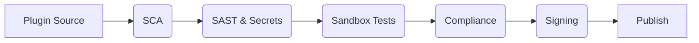
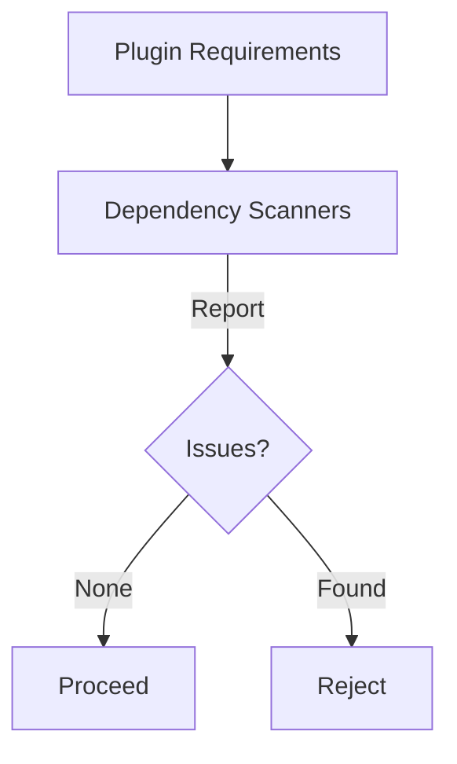
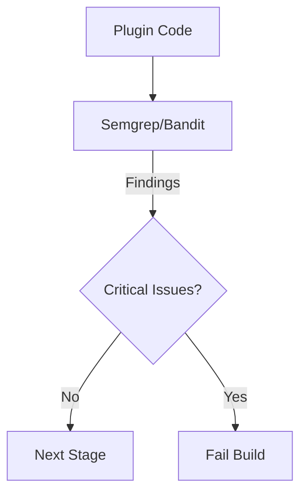
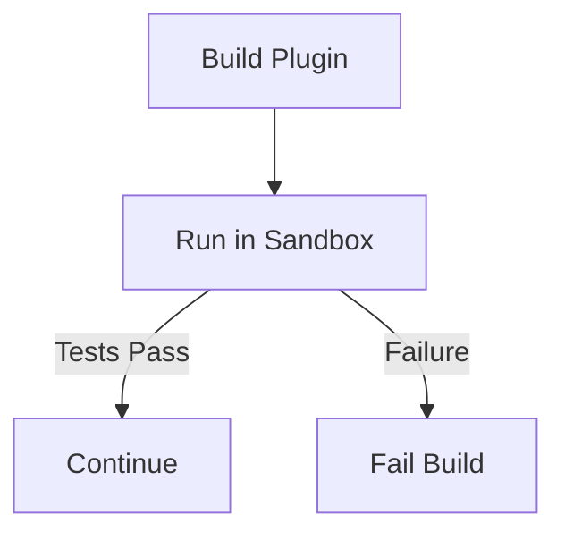
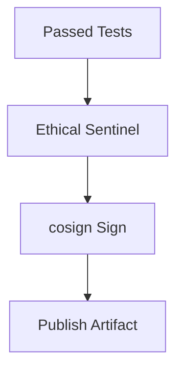

# Plugin Certification Pipeline

Task 203 introduces a multi-stage CI/CD workflow that automatically vets and signs third-party plugins before they are published. The pipeline rejects any plugin that fails a security or compliance gate.

## 1. Software Composition Analysis (SCA)
- Tools such as `pip-audit` and Snyk inspect dependencies for known CVEs and incompatible licenses.
- The job fails if a high-severity issue is detected.

## 2. Static Application Security Testing (SAST)
- Runs Semgrep and Bandit to detect insecure code patterns and secrets.
- Only a clean report allows the pipeline to continue.

## 3. Sandboxed Tests
- The plugin is executed inside the Docker sandbox described in [`sandbox.md`](sandbox.md).
- Unit tests run with the network disabled and the file system mounted read-only.

## 4. Compliance and Signing
- The Ethical Sentinel verifies policy compliance after sandbox execution.
- Successful artifacts are signed twice using `cosign` and uploaded to the marketplace.

This certification workflow ensures only trustworthy plugins become part of the ecosystem.
