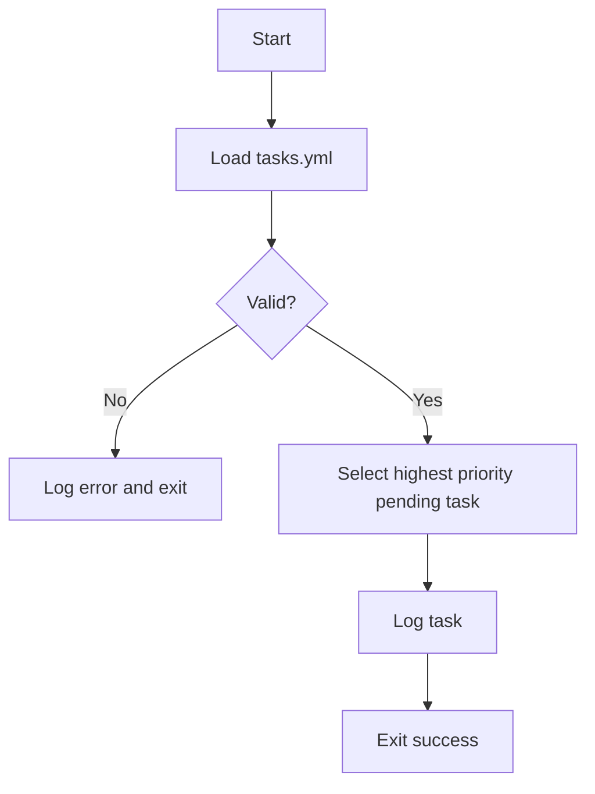
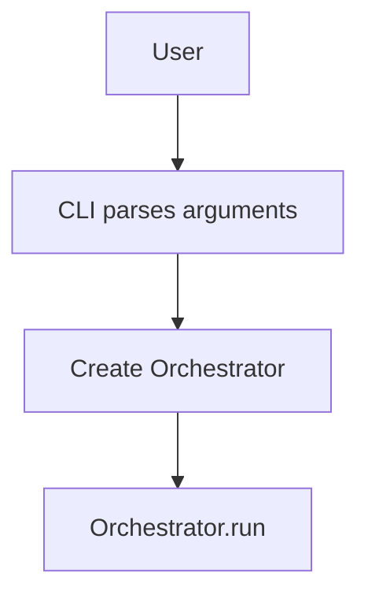
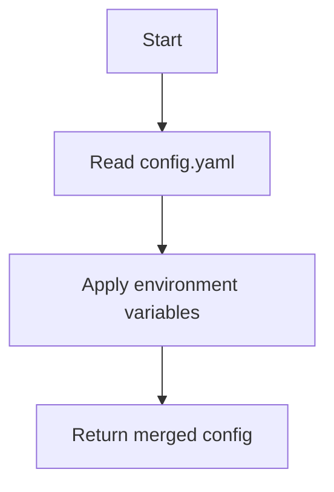

# Architecture Overview

This document captures the current state of the AI-SWA project. It summarizes the project goals, describes the agents defined in `AGENTS.md`, and traces our evolution based on the research conducted so far. The diagrams below are reproduced from `ARCHITECTURE.md` to visualize the core workflows.

## Project Goals
- **Self-Evolution** – Build an autonomous system that designs, implements and refines its own software architecture.
- **Open Collaboration** – Create an open platform where agents and human contributors work together responsibly.
- **Living Architecture** – Keep architectural plans and code in sync so that the system can reason about technical debt and improvement opportunities.

These goals derive from the repository's [README](../../README.md) and [VISION](../../VISION.md) documents.

## Registered Agents
The platform organizes work through specialized agents, each with a clear role:

| Agent ID | Role | Responsibilities | Status |
|---------|------|-----------------|--------|
| `SWA-CORE-01` | Core Architect | Implements features from `tasks.yml`, refines `ARCHITECTURE.md`, and maintains unit tests. | Active |
| `SWA-QA-01` | QA & Security Agent | Performs static analysis and security scanning and files bug tasks. | Proposed |
| `SWA-DOCS-01` | Documentation Agent | Keeps comments and docs aligned with code and generates changelogs. | Proposed |
| `SWA-SUPER-01` | Supervisor Agent | Oversees the lifecycle and activates other agents based on task labels. | Proposed |

_A detailed specification for each agent is maintained in [`AGENTS.md`](../../AGENTS.md)._

## Evolution of the Architecture
Research briefs have guided the design of our multi-agent system:
- **Cross-Language Design** – Explores combining Python, Rust and Node.js for performance and I/O separation【F:research/RB-004_Cross_Language_Design.md†L1-L12】.
- **Metrics & Observability** – Defines an OpenTelemetry and Prometheus stack for continuous feedback【F:research/RB-005_Metrics_and_Observability.md†L1-L11】.
- **Plugin Governance** – Outlines automated CI/CD checks for plugin security and compliance【F:docs/research/RB-002_Strategic_Roadmap_Extension.md†L1-L15】.
- **External Repo Insights** – Summarizes lessons from Gemini CLI and OpenAI Codex to inform our own CLI architecture【F:research/RB-010_External_Repo_Insights.md†L1-L10】.
These briefs inform new components like the Reflector and Ethical Sentinel which are scheduled in later roadmap phases.

## Core Workflows
### Main Orchestration Loop
```mermaid
flowchart TD
    subgraph Orchestrator Run Cycle
        direction LR
        StartRun[Start run()] --> LoadTasks(Load tasks from Memory)
        LoadTasks --> RunReflector(Call Reflector.run_cycle())
        RunReflector --> SaveReflectedTasks(Save updated tasks to Memory)
        SaveReflectedTasks --> LoopDecision{Actionable task?}

        subgraph Task Execution Loop
            direction LR
            LoopDecision -- Yes --> PlanNext(Planner.plan())
            PlanNext --> TaskSelected{Task available?}
            TaskSelected -- Yes --> MarkInProgress(Update task: in_progress)
            MarkInProgress --> SaveInProgress(Save tasks to Memory)
            SaveInProgress --> ExecuteTask(Executor.execute())
            ExecuteTask --> MarkDone(Update task: done)
            MarkDone --> SaveDone(Save tasks to Memory)
            SaveDone --> LoopDecision
        end

        TaskSelected -- No --> EndLoop(End Loop)
        LoopDecision -- No --> EndLoop
        EndLoop --> FinishRun[Finish run()]
    end
```

### Bootstrapping Flow


### CLI Invocation Flow


### Configuration Flow


## Roadmap and Future Research
The [roadmap](../ROADMAP.md) outlines phased milestones from foundation to ecosystem governance. Building on this, research tasks propose:
1. Vision Engine prioritization using heuristics and reinforcement learning.
2. A cross-language microservice architecture with Rust and Node.js components.
3. Advanced metrics and observability feeding back into the Reflector.
4. Plugin marketplace governance with automated policy checks.
5. Ethical Sentinel enforcement for secure, responsible evolution.

These directions will shape the next iterations of the architecture as new agents come online and the platform matures.
